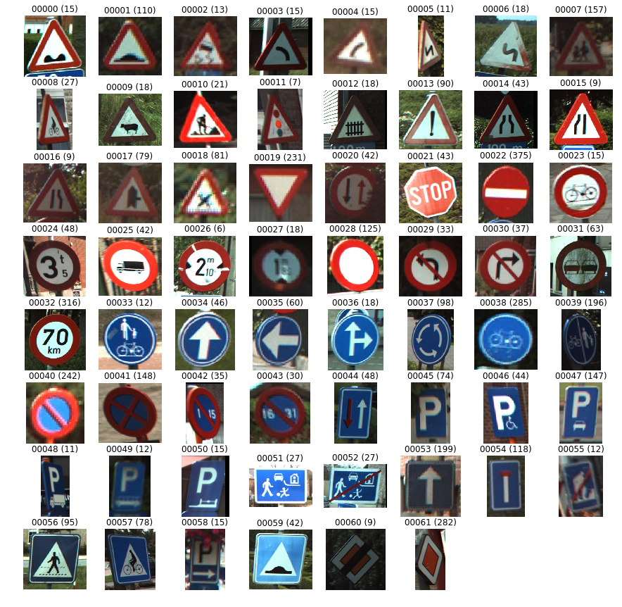
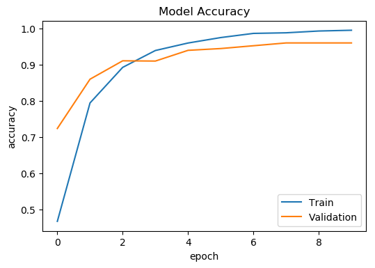
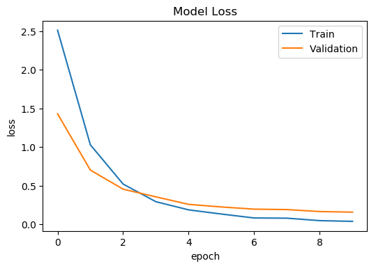
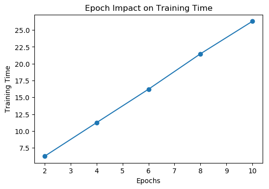
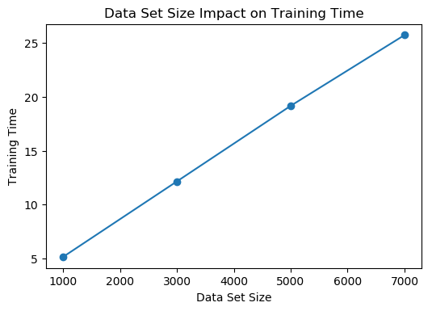

# Street Sign Classifier Report

This project implements a street sign classifier using deep learning. This project is written in Python 3.6. The `keras`, `tensorflow`, and `scikit-learn` packages were used to build the model. Data visualization and preprocessing was done with the `matplotlib` and `scikit-image` packages.

**Note:** Please also read the update to this report [here](https://github.com/Hopding/street-sign-classifier/blob/master/notebooks/report_update.md).

## Dataset

The following two datasets were considered for this project:

- [LISA Traffic Sign Dataset](http://cvrr.ucsd.edu/LISA/lisa-traffic-sign-dataset.html) - a set of pictures and videos with annotated frames containing US traffic signs.
- [BelgiumTS Dataset](https://btsd.ethz.ch/shareddata/) - a set of labelled pictures containing Belgium traffic signs.

The BelgiumTS dataset was selected due to its simplicity and smaller size. The LISA dataset is very large, and has far more data than is necessary for a small-scale project like this.

## Splitting

The BelgiumTS dataset is pre-split into training and test sets upon download. This would be convenient if only training and test sets were needed. However, a validation set is also necessary. So instead of using the pre-split data, I merged them back together into a single dataset. I then randomly split this merged dataset into training (60%), validation (20%), and test (20%) sets.

## Resizing

The BelgiumTS dataset contains 62 classes of street signs, with 7095 images in total. The number of images in each class varies from as few as 6, up to 285. The visualization below contains a single image from each class in the dataset.



As you can see from the visualization, the images do not have a standard size. This means that the images must be resized to a standard width and height before they can be fed as input to a neural network.

I resized the images to 32x32 pixels. This was done using `scikit-image`. A few different sizes were tested: 16x16, 32x32, and 64x64. I found that 32x32 gave us the same accuracy as 64x64, while being faster to train with. 16x16 was ruled out because the it resulted in the DNN being ~3% less accurate than with 32x32.

## Network Architecture

I used a dconvolutional network model to classify the street signs. I chose this type of model because they are known to perform quite well on image datasets, such as MNIST and ImageNet. The architecture of the final version of the Keras model is shown below.

```python
model = Sequential()

model.add(Conv2D(64, (3, 3), input_shape=(32, 32, 3), activation='relu'))
model.add(MaxPooling2D(pool_size=(2, 2)))
model.add(Flatten())
model.add(Dense(64, activation='relu'))
model.add(Dense(62, activation='softmax'))

model.compile(optimizer='adam', loss='categorical_crossentropy', metrics=['accuracy'])
```

This architecture is a relatively simple convolutional network. It achieves an accuracy of ~96% on the validation dataset. This model was the most accurate and simple model to arise from a few different variants. Listed below are some of the variants I tried out.

- Decreasing the number of filters in the first convolutional layer from 64 to 16. This resulted in a faster training time. However, the accuracy decreased by ~2%.
- Decreasing the number of filters in the first convolutional layer from 64 to 32. This resulted in a faster training time. However, the accuracy decreased by ~1%.
- Adding a 0.2 dropout layer after the first max pooling layer. This did not affect accuracy.
- Adding another convolutional and max pooling layer after the first max pooling layer. This did not affect accuracy.
- Increasing the number of units in the first dense layer from 64 to 128. This did not affect accuracy.
- Decreasing the number of units in the first dense layer from 64 to 32. This decreased accuracy by ~10%.

## Results

When trained for 10 epochs with a batch size of 50, this network is able to obtain an accuracy of 96% with a ~0.15 loss on the test dataset.

## Benchmarks

There are many different traffic sign datasets and benchmarks in common use today. Generalizing across datasets, state-of-the-art models are usually able to reach accuracies in the 94-98% range. This puts my model in the lower end of the spectrum for state-of-the-art models.

Listed below are some articles and papers documenting traffic sign classification models and their accuracies:

- https://arxiv.org/pdf/1805.12289.pdf
- https://arxiv.org/ftp/arxiv/papers/1712/1712.04391.pdf
- https://btsd.ethz.ch/shareddata/publications/Mathias-IJCNN-2013.pdf
- https://towardsdatascience.com/recognizing-traffic-signs-with-over-98-accuracy-using-deep-learning-86737aedc2ab

[This paper](https://btsd.ethz.ch/shareddata/publications/Mathias-IJCNN-2013.pdf) documents the performance of several models on the same BTSC dataset I used. My model is right around the average performance of other models, which is 95-97%. Interestingly, one model in this paper was able to achieve a superhuman performance of 99.46% on the dataset (human performance is 98.84%). However, the paper notes that "this quality improvement comes to the price of 37 hours of training on dedicated hardware (using 4 GPUs)."

## Learning Curves

Shown below is a plot of the model's accuracy on the training and validation datasets per epoch during training.


Shown below is a plot of the model's loss on the training and validation datasets per epoch during training.


## Training Time

The relationship between training time and number of epochs is linear.



The relationship between training time and dataset size is also linear.


