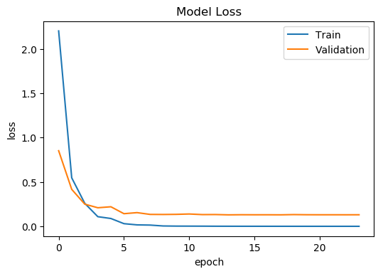

# Street Sign Classifier Report - Update

This notebook is an update to the [original project report](https://github.com/Hopding/street-sign-classifier/blob/master/notebooks/report.ipynb)

## Original Model

The model documented in the original report was a very simple one. It only had a single convolutional layer. This model achieved an accuracy of 95-96% with a ~0.15 loss on the test dataset.

## VGG19 Model

I was able to achieve an accuracy of 97-98% with a ~0.11 loss on the test dataset using an improved model. This model utilizes tranfer learning and early stopping to improve its accuracy.

The initial layers of the network are copied from the VGG19 network. The weights of the bottom seven layers are frozen. A single convolutional layer and a couple of dense layers are stacked on top of this. These layers are not frozen during training.

The architecture of this improved Keras model is shown below.

```python
vgg_model = VGG19(weights='imagenet', include_top=False, input_shape=X[0].shape)

layer_dict = dict([(layer.name, layer) for layer in vgg_model.layers])

x = layer_dict['block2_pool'].output

x = Conv2D(filters=64, kernel_size=(3, 3), activation='relu')(x)
x = MaxPooling2D(pool_size=(2, 2))(x)
x = Flatten()(x)
x = Dense(64, activation='relu')(x)
x = Dense(len(unique_labels), activation='softmax')(x)

model = Model(inputs=vgg_model.input, outputs=x)

for layer in model.layers[0:7]:
    layer.trainable = False

model.compile(
  loss='categorical_crossentropy',
  optimizer='adam',
  metrics=['accuracy'],
)

early_stopping = EarlyStopping(
    monitor='val_loss',
    patience=10,
    verbose=0,
    mode='min',
)
model_checkpoint = ModelCheckpoint(
    'vgg19_final_weights.hdf5',
    save_best_only=True,
    save_weights_only=True,
    monitor='val_loss',
    mode='min',
)
reduce_lr_loss = ReduceLROnPlateau(
    monitor='val_loss',
    factor=0.1,
    patience=7,
    verbose=1,
    min_delta=1e-4,
    mode='min',
)

history = model.fit(
    X_train,
    y_train,
    validation_data=(X_valid, y_valid),
    batch_size=50,
    epochs=50,
    verbose=1,
    callbacks=[early_stopping, model_checkpoint, reduce_lr_loss],
)

model.load_weights('vgg19_final_weights.hdf5')
```

Shown below is a plot of the improved model's accuracy on the training and validation datasets per epoch during training.


Shown below is a plot of the improved model's loss on the training and validation datasets per epoch during training.


The improved model is available [here](https://github.com/Hopding/street-sign-classifier/blob/master/notebooks/final_model.ipynb)

## Image Augmentation

I also tried using image augmentation in the improved model. This, however, did not improve the accuracy. In fact, certain augmentation decreased the model's accuracy to as low as 90%. Listed below are the Keras [image transformations](https://keras.io/preprocessing/image/#imagedatagenerator-class) I tried, and their effects on the model's accuracy:

| Augmentation                         | Effect on Accuracy |
| ------------------------------------ | ------------------ |
| `featurewise_center=True`            | decreased          |
| `featurewise_std_normalization=True` | decreased          |
| `rotation_range=10`                  | decreased          |
| `width_shift_range=0.2`              | no effect          |
| `height_shift_range=0.2`             | no effect          |

The model I built using image augmentation is available [here](https://github.com/Hopding/street-sign-classifier/blob/master/notebooks/vgg19_augmentation_model.ipynb)
